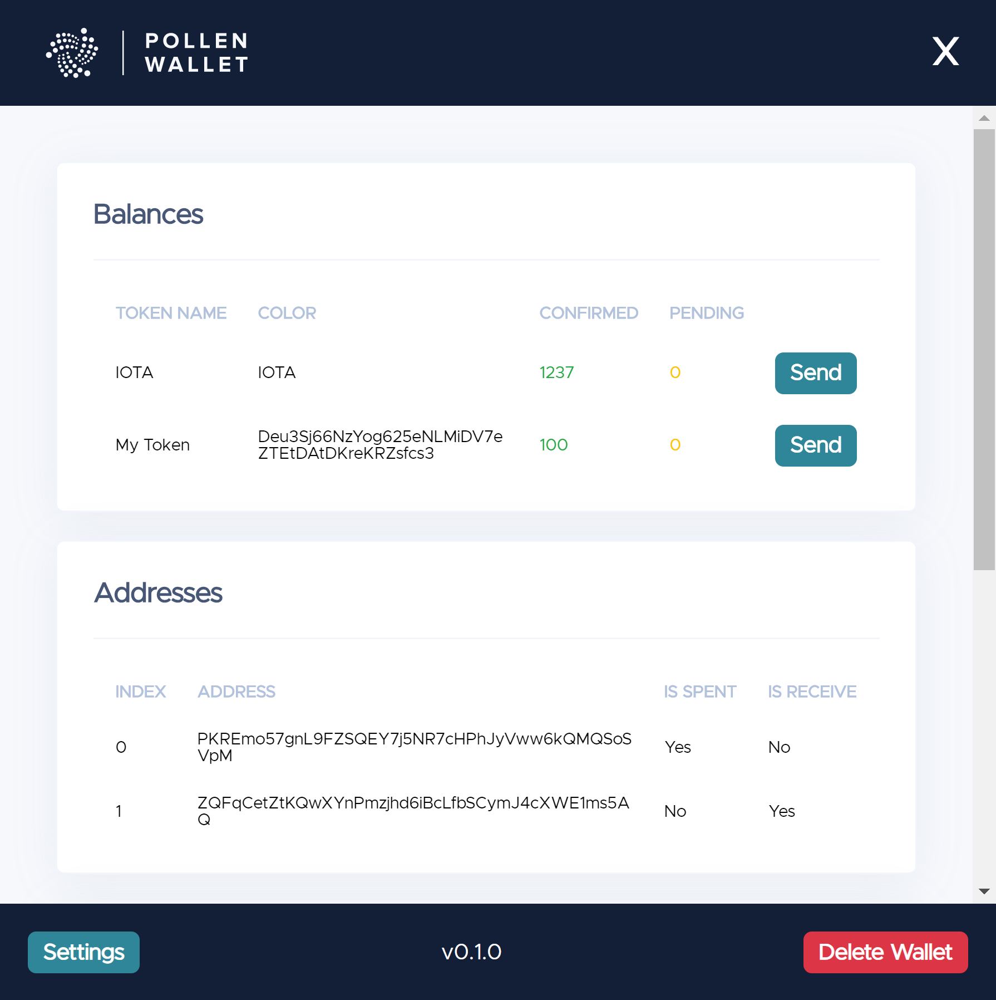
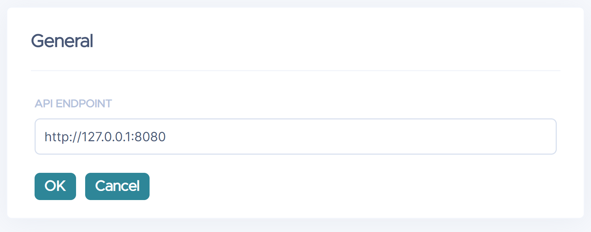

# IOTA Pollen GUI Wallet

IOTA Pollen wallet GUI, a lightweight wallet for the test Pollen network.

This application is a React app wrapped in the Electron runtime.

**Disclaimer** - This wallet is intended to demonstrate how to communicate with the new Pollen network, your seed is **NOT** stored securely.



## Building

```
npm install
npm run build
```

Once you have built the main app you can package it for your platform, detailed below. The `/out` folder will contain the executable for your platform when packaging completes.

### Windows

```shell
npm run package-win
```

### Mac

```shell
npm run package-mac
```

### Linux

```shell
npm run package-linux
```

## Settings

By default the application is configured to access a `GoShimmer` nodes API running on your local machine at `http://127.0.0.1:8080`. To make it communicate with another node you can change the endpoint in the settings page.

